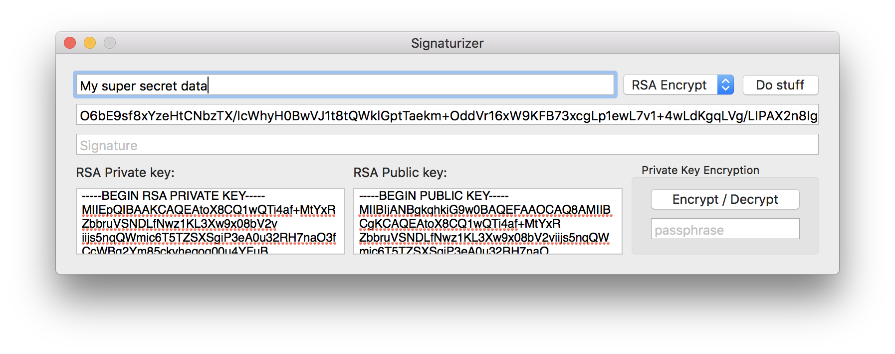

# Signaturizer

This is a demo app I made with Swift. Just messing around with different hashing algorithms and RSA cryptography.
For now, it is using SwCrypt library. (c'mon)

Features implemented:
* RSA Encryption (with Public Key) / Decryption (with Private Key)
* RSA Signing (with Private Key) / Verifying (with Public Key)
* Private Key Encryption / Decryption
* SHA256, MD5 Hashing
* Base64 Coding / Decoding

Looks like this:

